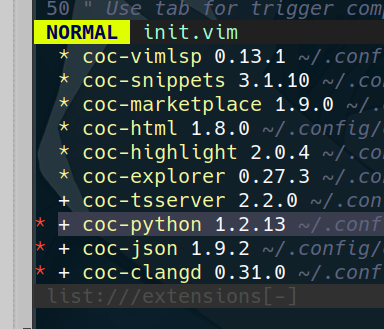

+++
date = '2024-11-19'
title = 'How To Config Vim'
author = 'Saka'
description = "Guide to emoji usage in Hugo"
categories = [
    "Original"
]
tags = [
    "emoji",
]
image = "image.png"
+++
# Install Part

### Install NeoVim

first you need to try neovim, remember to install it’s newest version from github release (apt install is too old version)

[https://github.com/neovim/neovim](https://github.com/neovim/neovim)

### Then you will need vim-plug to install plugins

[https://github.com/junegunn/vim-plug](https://github.com/junegunn/vim-plug)

remember to reopen config file to finish your config

use the command line below to install what plugins you want:

```bash
:PlugInstall [plugname]
```

then add its’ github link to your config file, plz reference the github page of vim-plug above

### Install coc.nvim to make your nvim like a real IDE

make sure you have updated your neovim to the newest version

[https://github.com/neoclide/coc.nvim](https://github.com/neoclide/coc.nvim)

use the command line below to install plugs of coc.nvim:

```bash
:CocInstall coc-json
```

---

You can install `coc-marketplace` first and use the command below to find plugs of coc.nvim:

```markdown
:CocInstall Coc-marketplace

:CocList marketplace
```

also use the command line below to check what you have installed:

```bash
:CocList extensions
```

then you can press <tap> to get further action


what CocPlugs I’ve installed are above

## Config Your Neovim

enter `~/.config` and make /nvim/init.vim

here is my config:


  

[https://github.com/ChouYuduki/NeovimSettings](https://github.com/ChouYuduki/NeovimSettings)

```markdown
set number     
set cursorline  
set showcmd " show what you did on the lower right corner
set wildmenu 
set hlsearch   
set incsearch
set ignorecase
set smartcase
set tabstop=4
set softtabstop=4
set shiftwidth=4
set noexpandtab
set autoindent
set cindent

noremap h i
noremap H I

noremap i k
noremap I 5k
noremap K 5j
noremap k j
noremap j h

" open file-tree explorer by typing tt
noremap tt :CocCommand explorer<CR>

map s <nop>
map S :w<CR>
map Q :q<CR>
map R :source $MYVIMRC<CR>

call plug#begin()

Plug 'vim-airline/vim-airline'
Plug 'connorholyday/vim-snazzy'
Plug 'neoclide/coc.nvim', {'branch': 'release'}
Plug 'jiangmiao/auto-pairs'

call plug#end()

let g:SnazzyTransparent = 1
color snazzy

" initial coc.nvim plugins
let g:coc_global_extensions = [ 'coc-json', 'coc-vimlsp', 'coc-marketplace', 'coc-highlight' ]

" Use tab for trigger completion with characters ahead and navigate
" NOTE: There's always complete item selected by default, you may want to enable
" no select by `"suggest.noselect": true` in your configuration file
" NOTE: Use command ':verbose imap <tab>' to make sure tab is not mapped by
" other plugin before putting this into your config
inoremap <silent><expr> <TAB>
      \ coc#pum#visible() ? coc#pum#next(1) :
      \ CheckBackspace() ? "\<Tab>" :
      \ coc#refresh()
inoremap <expr><S-TAB> coc#pum#visible() ? coc#pum#prev(1) : "\<C-h>"

" Make <CR> to accept selected completion item or notify coc.nvim to format
" <C-g>u breaks current undo, please make your own choice
inoremap <silent><expr> <CR> coc#pum#visible() ? coc#pum#confirm()
                              \: "\<C-g>u\<CR>\<c-r>=coc#on_enter()\<CR>"

function! CheckBackspace() abort
  let col = col('.') - 1
  return !col || getline('.')[col - 1]  =~# '\s'
endfunction

" Use <ctrl-space> to trigger completion
inoremap <silent><expr> <c-space> coc#refresh()

" Highlight the same thing and its references when holding the cursor
autocmd CursorHold * silent call CocActionAsync('highlight')

```